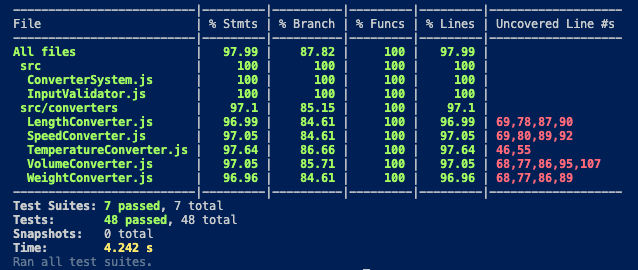
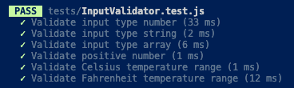
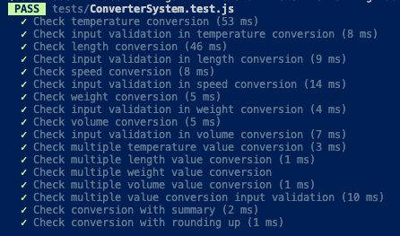
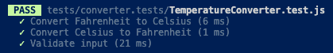
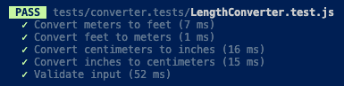
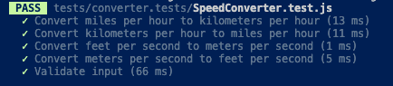
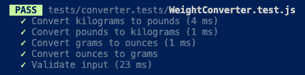
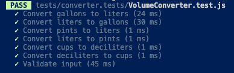

# Testrapport 

För att köra testerna, använd följande kommando i terminalen:

```sh
npm test
```

De individuella Jest-testfallen för varje klass finns i /tests mappen. Varje klass har sin egen testfil och varje metod har testats. 
En testfall kan inkludera flera tester som testar samma funktion med olika typer av indata.

Det finns 48 tester totalt.

## Testresultat



Raderna som inte täcks av testfallen är default fallen i switch satserna. 

### InputValidator
| Vad som testats | Hur det har testats | Testresultat |
|----------------------------------|---------------------|--------------|
| Validate input type number | Jest | OK |
| Validate input type string | Jest | OK |
| Validate input type array | Jest | OK |
| Validate positive number | Jest | OK |
| Validate Celsius temperature range | Jest | OK |
| Validate Fahrenheit temperature range | Jest | OK |



### ConverterSystem
| Vad som testats | Hur det har testats | Testresultat |
|----------------------------------|---------------------|--------------|
| Check temperature conversion | Jest | OK |
| Check input validation in temperature conversion | Jest | OK |
| Check length conversion | Jest | OK |
| Check input validation in length conversion | Jest | OK |
| Check speed conversion | Jest | OK |
| Check input validation in speed conversion | Jest | OK |
| Check weight conversion | Jest | OK |
| Check input validation in weight conversion | Jest | OK |
| Check volume conversion | Jest | OK |
| Check input validation in volume conversion | Jest | OK |
| Check multiple temperature value conversion | Jest | OK |
| Check multiple length value conversion | Jest | OK |
| Check multiple weight value conversion | Jest | OK |
| Check multiple volume value conversion | Jest | OK |
| Check multiple value conversion input validation | Jest | OK |
| Check conversion with summary | Jest | OK |
| Check conversion with rounding up | Jest | OK |



### TemperatureConverter
| Vad som testats | Hur det har testats | Testresultat |
|----------------------------------|---------------------|--------------|
| Convert Fahrenheit to Celsius | Jest | OK |
| Convert Celsius to Fahrenheit | Jest | OK |
| Validate input | Jest | OK |



### LengthConverter
| Vad som testats | Hur det har testats | Testresultat |
|----------------------------------|---------------------|--------------|
| Convert meters to feet | Jest | OK |
| Convert feet to meters | Jest | OK |
| Convert centimeters to inches | Jest | OK |
| Convert inches to centimeters | Jest | OK |
| Validate input | Jest | OK |



### SpeedConverter
| Vad som testats | Hur det har testats | Testresultat |
|----------------------------------|---------------------|--------------|
| Convert miles per hour to kilometers per hour | Jest | OK |
| Convert kilometers per hour to miles per hour | Jest | OK |
| Convert feet per second to meters per second | Jest | OK |
| Convert meters per second to feet per second | Jest | OK |
| Validate input | Jest | OK |



### WeightConverter
| Vad som testats | Hur det har testats | Testresultat |
|----------------------------------|---------------------|--------------|
| Convert kilograms to pounds | Jest | OK |
| Convert pounds to kilograms | Jest | OK |
| Convert grams to ounces | Jest | OK |
| Convert ounces to grams | Jest | OK |
| Validate input | Jest | OK |



### VolumeConverter
| Vad som testats | Hur det har testats | Testresultat |
|----------------------------------|---------------------|--------------|
| Convert gallons to liters | Jest | OK |
| Convert liters to gallons | Jest | OK |
| Convert pints to liters | Jest | OK |
| Convert liters to pints | Jest | OK |
| Convert cups to deciliters | Jest | OK |
| Convert deciliters to cups | Jest | OK |
| Validate input | Jest | OK |


